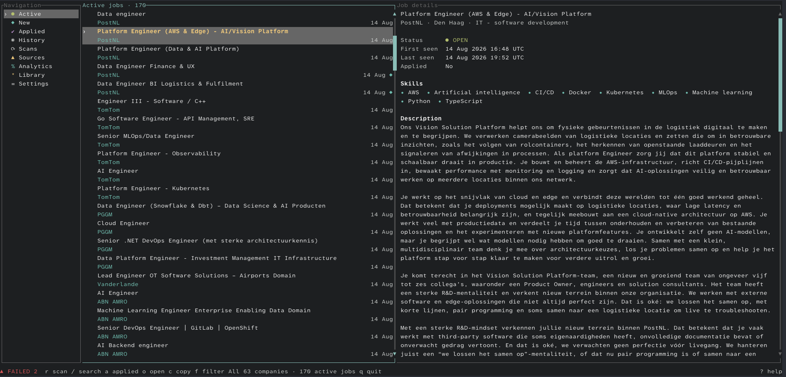
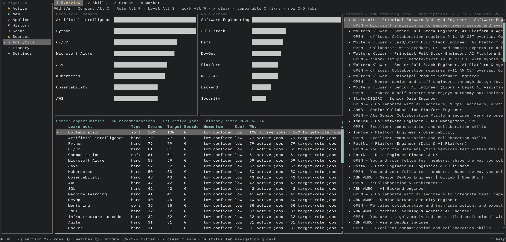
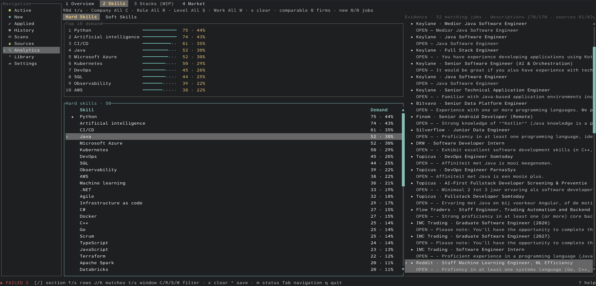

# TechJobsNL — Tech Job Search for the Netherlands

[](https://github.com/imhalawa/techjobsnl/actions/workflows/ci.yml)
[](https://github.com/imhalawa/techjobsnl/actions/workflows/release.yml)
[](https://github.com/imhalawa/techjobsnl/releases/latest)
[](LICENSE)

**Find tech jobs in the Netherlands by the skills they mention—not only by job title.**

TechJobsNL is an open-source, local-first Rust TUI for finding technology jobs in the Netherlands by company, role, and skill. It scans verified company career sources, keeps job history in SQLite, and links skill-demand analytics back to the exact vacancies behind them.


> **Beta v0.1.0:** the core workflow is tested, but the interface and configuration may still change. Back up your configuration and database before upgrading.

[Website](https://imhalawa.github.io/techjobsnl/) · [Install](#install) · [Workflow](#how-it-works) · [Analytics](#evidence-linked-analytics) · [Documentation](#documentation) · [Contributing](#development-and-contributing)

## What it does

- **Search real vacancies:** review stored descriptions, search by title or company, and open the official posting.
- **Discover jobs through skills:** select a hard or soft skill to see the exact matching vacancies and text evidence.
- **Follow specific companies:** search the catalog in Settings and enable or disable sources without editing TOML.
- **Track the job lifecycle:** mark applications and retain jobs that close or later reopen.
- **Keep your data local:** configuration, jobs, history, analytics, application state, and saved items stay on your machine.
- **Fail safely:** incomplete and failed company scans preserve the last trusted jobs instead of falsely closing them.

The beta ships with **66 company profiles**, **65 enabled verified sources**, and **35 source strategies**. This is a documented company set, not the whole Netherlands labour market. See [Supported companies](SUPPORTED_COMPANIES.md) and [Source evidence](SOURCES.md).

## Install

The latest release provides checksum-verified native archives for macOS, Linux, and Windows on x86-64 and ARM64.

### macOS and Linux

```bash
curl --proto '=https' --tlsv1.2 -LsSf https://raw.githubusercontent.com/imhalawa/techjobsnl/main/scripts/install.sh | sh && "$HOME/.local/bin/techjobsnl"
```

The installer writes to `~/.local/bin` by default and tells you if that directory is not on `PATH`.

### Windows

```powershell
irm https://raw.githubusercontent.com/imhalawa/techjobsnl/main/scripts/install.ps1 | iex; if ($?) { & "$env:LOCALAPPDATA\Programs\techjobsnl\bin\techjobsnl.exe" }
```

The installer writes to `%LOCALAPPDATA%\Programs\techjobsnl\bin` and adds that directory to the user `PATH`. Open a new terminal if `techjobsnl` is not immediately available.

| Platform | Architectures | Requirement |
|---|---|---|
| macOS | Intel, Apple silicon | Unsigned beta binary |
| Linux | x86-64, ARM64 | glibc 2.35 or newer |
| Windows | x86-64, ARM64 | Windows 10 or newer; unsigned beta binary |

Because the beta binaries are not code-signed, macOS Gatekeeper or Windows SmartScreen may ask for confirmation. You can also download an archive and `SHA256SUMS` directly from [GitHub Releases](https://github.com/imhalawa/techjobsnl/releases/latest).

To install a specific release, set `TECHJOBSNL_VERSION=v0.1.0` on macOS/Linux or `$env:TECHJOBSNL_VERSION = "v0.1.0"` on Windows before running the installer. `TECHJOBSNL_INSTALL_DIR` changes the destination.

### Update or uninstall

Run the installer again to update the executable. Configuration, job history, and application state are preserved.

macOS and Linux:

```bash
curl --proto '=https' --tlsv1.2 -LsSf \
  https://raw.githubusercontent.com/imhalawa/techjobsnl/main/scripts/uninstall.sh | sh
```

Windows:

```powershell
irm https://raw.githubusercontent.com/imhalawa/techjobsnl/main/scripts/uninstall.ps1 | iex
```

The uninstallers remove the executable but preserve configuration and job history. The Windows uninstaller also removes its installation directory from the user `PATH`.

## How it works

1. Press `r` to scan the companies you follow.
2. Review **Active** or **New**, then use `/` to search by title or company.
3. Press `o` to open the official vacancy, `a` to mark an application, or `*` to save it.
4. Open **Analytics** and select a skill or market fact to inspect the matching vacancies.
5. Open **Settings → Companies** to focus later scans on the employers you care about.



The app supports keyboard and mouse input, responsive layouts, scrolling, clickable rows and tabs, and a draggable job/details divider. Press `?` for controls specific to the current view.

### Choose your companies

Company choices save immediately. Jobs from unfollowed companies are hidden, and later scans skip those sources without starting a scan at the time of the change.


## Evidence-linked analytics

Analytics is built from eligible vacancies stored on your machine. It covers hard and soft skills, roles, seniority, experience, work mode, employment, education, companies, and learn-next recommendations.

| Market overview | Hard-skill demand |
|---|---|
| [](docs/images/analytics-overview.png) | [](docs/images/analytics-skills.png) |

Select a skill or market fact to inspect the vacancies behind it. Compact top-10 charts show leading skill and role demand. Counts describe locally observed postings and are not presented as the complete Netherlands market. **Stacks remains visible but disabled while it is work in progress.**

Local matching uses the versioned bank in `assets/software-skills.json`; unknown words are not promoted automatically. Optional Claude or Codex CLI discovery may suggest emerging terms, but strict validation and explicit approval are required before a suggestion affects later extraction. No AI provider is required.

## Local data and safe scans

Startup reads stored data and makes no source requests. A scan starts only when you press `r`.

- A **complete** company scan may add, update, close, or reopen its jobs.
- An **incomplete** or **failed** scan stores diagnostics without changing that company's jobs.
- One company failure does not discard another company's valid result.
- Company choices and title filters persist in `config.toml`; jobs and user state persist in SQLite.

The default data locations are:

| Platform | Configuration and database directory |
|---|---|
| Linux | `${XDG_CONFIG_HOME:-~/.config}/techjobsnl/` |
| macOS | `~/Library/Application Support/techjobsnl/` |
| Windows | `%APPDATA%\techjobsnl\` |

An older `job-watch/config.toml` is reused automatically if the new path does not exist. Deleting the database permanently removes jobs, history, application markers, diagnostics, analytics state, and library choices. Read [Data and privacy](docs/DATA_AND_PRIVACY.md) before resetting or enabling optional AI discovery.

## Build from source

You need Git, Make, and a Rust toolchain that supports Rust edition 2024.

```bash
git clone https://github.com/imhalawa/techjobsnl.git
cd techjobsnl
make run
```

`make run` requires an interactive terminal. You can also install the tagged source with Cargo:

```bash
cargo install --locked --git https://github.com/imhalawa/techjobsnl.git --tag v0.1.0 techjobsnl
```

## Documentation

| Guide | Use it for |
|---|---|
| [User guide](docs/USER_GUIDE.md) | Views, workflows, keyboard and mouse controls, Analytics, and Settings |
| [Configuration](docs/CONFIGURATION.md) | Paths, filters, themes, keys, company profiles, and all 35 source strategies |
| [Supported companies](SUPPORTED_COMPANIES.md) | The 65 enabled companies, disabled source, and roadmap |
| [Source evidence](SOURCES.md) | Official endpoints, completeness evidence, live checks, and employer caveats |
| [Troubleshooting](docs/TROUBLESHOOTING.md) | Startup, scans, sources, browser, clipboard, Analytics, and reset |
| [Data and privacy](docs/DATA_AND_PRIVACY.md) | Stored data, network behavior, optional AI use, backup, and deletion |
| [Architecture](docs/ARCHITECTURE.md) | Runtime flow, module ownership, persistence, concurrency, and test boundaries |
| [Project structure](docs/PROJECT_STRUCTURE.md) | Repository map and where changes belong |
| [Contributing](CONTRIBUTING.md) | Development workflow, checks, source safety, and pull requests |

## Development and contributing

```bash
make check      # formatting, Clippy, release checks, and offline tests
make test-live  # ignored tests that contact external career sites
```

CI checks formatting, Clippy, offline tests, and a release build on Linux, macOS, and Windows for every pull request and push to `main`. Version tags matching `v*` publish checksum-verified archives for all three operating systems and both supported architectures.

Live tests are separate because career sites, vacancy counts, rate limits, and page contracts can change without a code change. Read [Contributing](CONTRIBUTING.md) before changing a source adapter.

## Scope and independence

TechJobsNL is an independent open-source project. It is not affiliated with, endorsed by, or sponsored by any listed company. Company names and trademarks belong to their owners, and job information can change at any time.

A company brand does not prove the legal employer or current visa-sponsor status. Confirm the employment entity and application requirements on the official vacancy. [Source evidence](SOURCES.md) keeps verified facts, inferences, and caveats separate.

## License

Copyright © 2026 Mohamed Halawa.

The source code is licensed under the [GNU Affero General Public License v3.0 only](LICENSE). The project does not claim ownership of third-party company names, trademarks, logos, or job-posting content. The software is provided without warranty under the license terms.

## Support

If TechJobsNL is useful to you, you can support its continued open-source development:

[](https://buymeacoffee.com/imhalawa)
