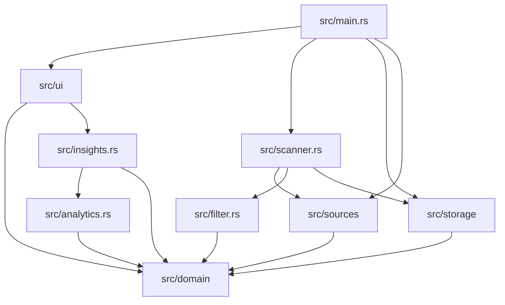

# Project structure

TechJobsNL is one package with a terminal UI and shared library.

```text
techjobsnl/
├── src/
│   ├── main.rs              # Binary startup, event loop, effects, and background work
│   ├── lib.rs               # Shared library modules
│   ├── config.rs            # TOML configuration and validation
│   ├── domain/              # Job and scan contracts
│   ├── sources/             # Official career-source adapters and HTTP helpers
│   ├── scanner.rs           # Concurrent scans, retries, outcomes, and persistence handoff
│   ├── filter.rs            # Country and title eligibility
│   ├── storage/             # SQLite schema, migrations, queries, and lifecycle updates
│   ├── analytics.rs         # Fact extraction and optional term discovery
│   ├── insights.rs          # Aggregation, comparisons, recommendations, and matching
│   └── ui/                  # Interaction state, rendering, and themes
├── assets/                  # Versioned skill and role taxonomies
├── tests/                   # Offline, UI, lifecycle, adapter, and ignored live tests
├── docs/                    # User, design, operations, and privacy documentation
├── SOURCES.md               # Source contracts, live evidence, and employer caveats
├── SUPPORTED_COMPANIES.md   # Current support snapshot and roadmap
├── CONTRIBUTING.md          # Development and pull request workflow
├── scripts/                 # Install and release-version scripts
├── .github/workflows/       # Three-OS CI and six-target release publishing
├── config.toml              # Shipped defaults and company catalog
├── Makefile                 # Common development commands
└── Cargo.toml               # Package metadata and dependencies
```

## Where changes belong

| Change | Start here | Usually also check |
|---|---|---|
| Add or change a source adapter | `src/sources/` | `src/main.rs`, `config.toml`, adapter tests, `SOURCES.md` |
| Change country or title eligibility | `src/filter.rs` | `src/config.rs`, `tests/filter_test.rs`, configuration docs |
| Change job lifecycle or persistence | `src/storage/` | `src/domain/`, storage and scanner tests, data docs |
| Change skill extraction | `src/analytics.rs`, `assets/` | `src/insights.rs`, analytics tests, user guide |
| Change reports or skill-based matching | `src/insights.rs`, `src/ui/app.rs` | `src/ui/render.rs`, UI tests, analytics docs |
| Change terminal behavior or layout | `src/ui/app.rs`, `src/ui/render.rs` | `src/ui/theme.rs`, `tests/ui_test.rs`, user guide |
| Change startup or side effects | `src/main.rs` | command tests, architecture and troubleshooting docs |
| Change installation or releases | `scripts/`, `.github/workflows/` | release tests and README |

## Dependency direction



`main.rs` may connect modules, but domain contracts should not depend on the UI, storage, or a particular source. Reuse an existing source adapter or helper before adding a company-specific implementation.

For runtime behavior and safety rules, see [Architecture](ARCHITECTURE.md). For development workflow, see [Contributing](../CONTRIBUTING.md).
