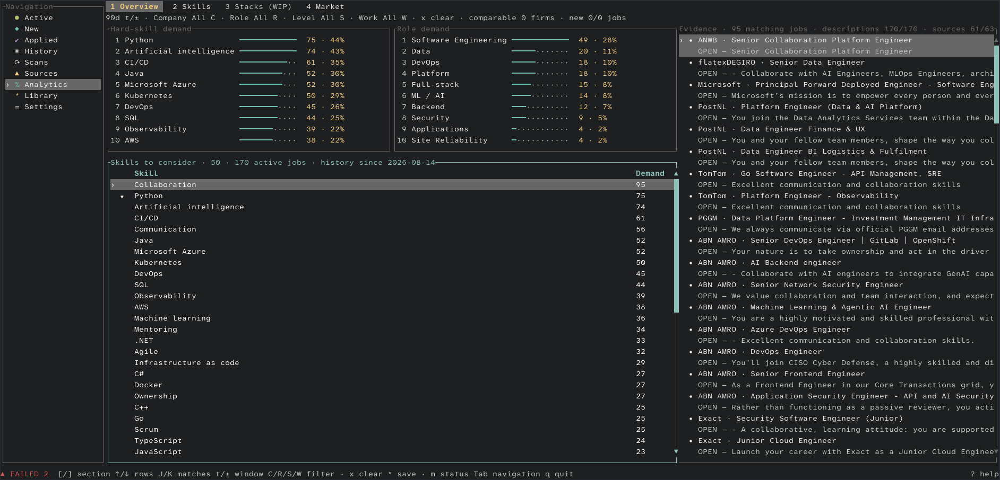
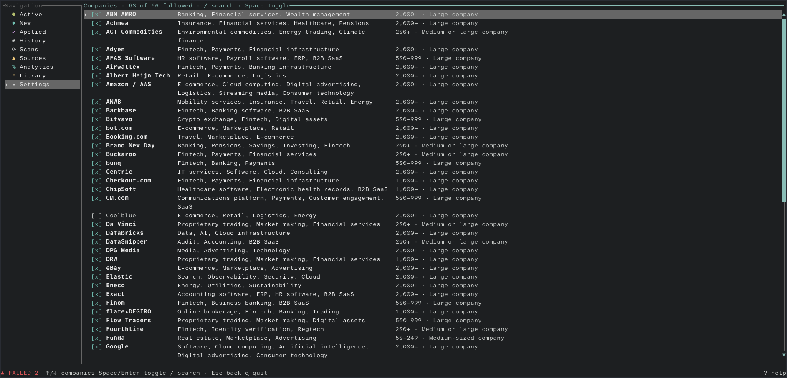

# User guide

Scan supported sources, review vacancies, track jobs, and inspect Analytics evidence.

## Start the app

From the repository root:

```bash
cargo run --release
```

Or use the Make target:

```bash
make run
```

`make run` requires an interactive terminal. On first start, TechJobsNL creates `config.toml` and its SQLite database in the platform-specific user configuration directory.

## Navigation

The left navigation contains nine views:

1. **Active:** eligible vacancies still present in their official source.
2. **New:** active jobs published within the configured age window. Jobs without a publication date are not marked new.
3. **Applied:** jobs you marked as applied, including retained historical records.
4. **History:** closed jobs and jobs that closed and later reopened.
5. **Scans:** the latest 100 company scan outcomes and diagnostics.
6. **Sources:** health, adapter, enabled state, last attempt, last success, and latest diagnostic for every company.
7. **Analytics:** demand, trends, evidence, and personal recommendations.
8. **Library:** saved jobs, skills, stacks, roles, and companies.
9. **Settings:** choose followed companies and edit job age, included title groups, and excluded title groups.

Press `Tab` or `Esc` to focus navigation, move with arrow keys or `j`/`k`, then press `Enter` to open the selected view. Inside a view, arrow keys or `j`/`k` move the current selection.

## Review jobs


The detail pane shows vacancy metadata, lifecycle and application state, extracted skills, and the stored description. `/` searches title and company; use Analytics to find vacancies by extracted facts.

- `/`: enter search mode. Search matches job title or company, not description text.
- `↑`/`↓`: move through matching jobs without leaving search mode.
- `Enter`: keep the current search and return to normal controls.
- `Esc` while editing: cancel and clear the search. To clear an accepted search, press `/`, then `Esc`.
- `f`: cycle through configured companies, New, Applied, then All.
- `a`: mark or unmark the selected job as applied.
- `o`: open the selected job's official URL in the default browser.
- `c`: copy the selected job URL to the clipboard.
- `J`/`K`: scroll the detail pane.
- `*`: save or remove the selected job from the Library. Saved rows show `★` (`S` with ASCII icons), and the footer confirms the action.
- `h`: switch directly between Active and History.

On terminals narrower than 80 columns, `Enter` opens or closes the selected job's detail view. On wider terminals, `Enter` opens the official job URL.

## Scan sources

Press `r` to scan all enabled companies. Scans use the configured concurrency, timeout, retry count, and user agent.

Each company finishes independently. See [Architecture](ARCHITECTURE.md#scan-safety) for storage rules.

- **Complete:** apply the result.
- **Incomplete or Failed:** store the diagnostic without changing that company's jobs.

One failed or incomplete company does not discard successful results from other companies. The footer shows an animated scan loader, current progress, completion feedback, and durable Failed or Incomplete source counts.

## Inspect source health

The Sources view helps separate a current source failure from old stored jobs. Use it to check which company failed, the adapter in use, when it was last attempted, when it last succeeded, and the latest diagnostic.

## Use analytics

Select an extracted skill or market fact to see the vacancies that contain the supporting evidence. Results describe only the postings TechJobsNL observed; they are not a complete measure of the Netherlands labour market.

Shared controls:

- `1`–`4` or `[`/`]`: switch Analytics sections.
- `t`: cycle 7, 30, and 90-day windows.
- `+`/`-`: add or remove one day from the window.
- `C`: cycle company filters.
- `R`: cycle role-family filters.
- `S`: cycle seniority filters.
- `W`: cycle work-mode filters.
- `x`: clear company, role, seniority, and work-mode filters while preserving the time window.
- Arrow keys or `j`/`k`: select rows.
- `J`/`K`: select matching evidence jobs.
- `Enter` or `o`: open the selected evidence job.
- `*`: save or remove the selected recommendation, skill, role, or company.

### Overview



Overview shows skill and role demand, recommendations, and matching vacancies.

### Skills


Use Left/Right or click to switch **Hard Skills** and **Soft Skills**. Select a skill to see matching vacancies; use `J`/`K` and `Enter` or `o` to open one. Press `m` to cycle a saved skill through Known, Learning, Interested, then no status.

Skill extraction uses the versioned local bank and exact posting aliases. Unknown words are not automatically promoted to skills.

### Stacks

Stacks is visible but disabled while the feature is work in progress.

### Market

Use Left/Right to switch between Roles, Seniority, Experience, Work, and Companies. The Work section includes work mode, employment, and education measures.

## Build a personal library

Select a job or an Analytics recommendation, skill, role, or company and press `*`. Then open Library and choose its matching section.

Library sections are selected with `1`–`5` or `[`/`]`:

1. **Jobs:** starred jobs, including closed or reopened saved jobs. Press `Enter` to locate an open job in Active or a closed job in History; use `o` to open its official URL and `c` to copy it.
2. **Skills:** saved skills and optional AI suggestions.
3. **Stacks:** saved technology paths.
4. **Roles:** saved role families; press `m` to mark or unmark a target role.
5. **Companies:** saved companies.

Press `*` to remove the selected library item. In Skills, press `m` to change status. Optional AI suggestions require explicit review: `a` approves and `d` rejects; suggestions never change analytics automatically.

## Change simple settings



Select a setting and press `Enter` or Space to edit it:

- **New jobs:** publication-age window in days.
- **Companies:** use `/` to search and Space or `Enter` to follow or unfollow a company. Changes save immediately; unfollowed companies are hidden and skipped by later scans. Following none is allowed.
- **Job types:** six built-in included-title groups plus optional custom regular expressions.
- **Hide jobs:** five built-in excluded-title groups plus optional custom regular expressions.

Title changes apply on the next scan. Clearing all included title patterns permits every job type; clearing all excluded title patterns excludes none. Use the full configuration file for country, scan, analytics, theme, keybinding, and source details.

## Mouse and responsive layout

- Click navigation items, rows, Analytics tabs, Library tabs, Settings fields, or Help.
- Use the wheel over a list to change selection and over details to scroll.
- Drag the divider between the job list and details to resize the panes for the current session.
- On narrow terminals, details open separately.

## Built-in help

Press `?` to open context-aware controls; press `?` or `Esc` to close them.
