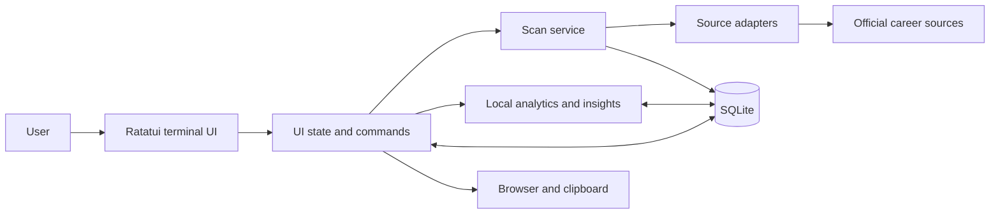
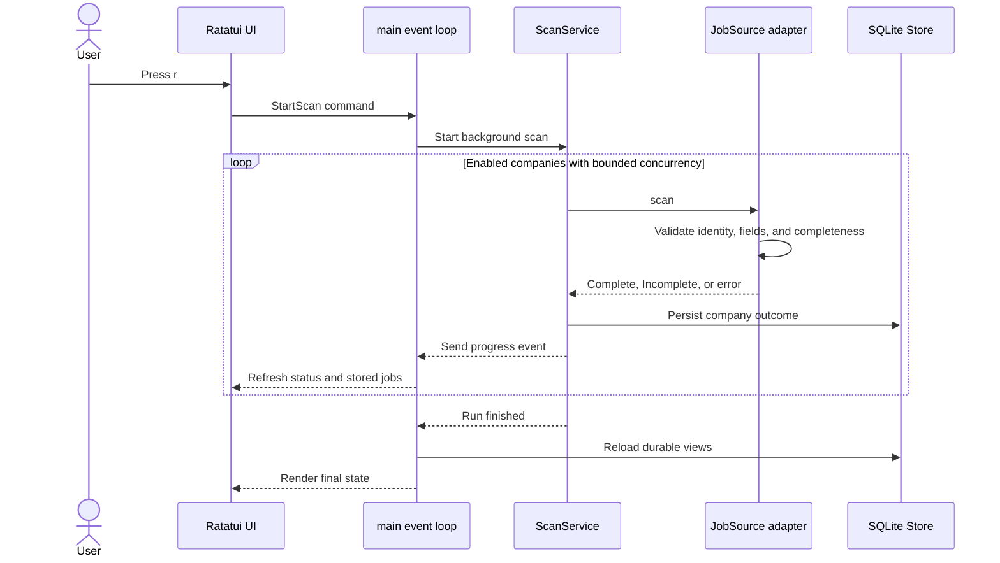
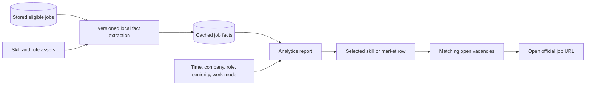

# Architecture

TechJobsNL is a local vacancy research workflow built as a single Rust binary with a shared library. Users can review jobs directly or select an extracted skill or market fact to see matching posting evidence. The code keeps source collection, filtering, storage, analytics, and terminal rendering separate so failures remain local and testable.

## High-level design

`src/main.rs` is the composition root [the place that connects the parts]. It builds source adapters from configuration, starts background work, applies `AppCommand` effects, reloads stored read models, and owns terminal startup and shutdown.

The terminal UI does not call career sites directly. Scans go through `ScanService` and a `JobSource` adapter; vacancy collection writes normalized records to SQLite, while evidence-linked exploration and analytics read them.

## Runtime flow

1. `main.rs` resolves the platform configuration directory, creates or refreshes `config.toml`, validates it, and opens the SQLite database.
2. `storage` loads the requested job view, scan history, source health, analytics state, library, and reviewed suggestions.
3. `ui::App` owns interaction state while `ui::render` draws it with Ratatui.
4. Pressing `r` starts `ScanService`, which runs enabled company sources with bounded concurrency.
5. Each adapter returns Complete, Incomplete, or Failed. Storage commits each company outcome independently.
6. The UI reloads durable read models after company outcomes and computes Analytics in background work.
7. Changing Settings → Companies updates `config.toml` and SQLite, rebuilds the runtime scan service for later scans, and reloads visible data without starting a scan.

## Module responsibilities

| Module | Responsibility |
|---|---|
| `src/main.rs` | Startup, platform paths, terminal lifecycle, event loop, background tasks, browser and clipboard actions |
| `src/config.rs` | TOML model, defaults, source strategy model, and validation |
| `src/sources/` | Official-source HTTP clients, parsing, pagination, identity checks, completeness checks, and normalized observations |
| `src/filter.rs` | Country and title eligibility classification |
| `src/scanner.rs` | Concurrency, timeout, retry, company isolation, events, and persistence handoff |
| `src/domain/` | Jobs, keys, scan events, source outcomes, and failure categories |
| `src/storage/` | SQLite schema, migrations, lifecycle updates, snapshots, analytics cache, source health, and library state |
| `src/analytics.rs` | Local fact extraction, taxonomy aliases, exact evidence, optional emerging-term discovery, and cache versioning |
| `src/insights.rs` | Time-window comparisons, momentum, confidence, stacks, recommendations, and library models |
| `src/ui/app.rs` | View state, selection, filters, commands, mouse targets, and responsive behavior |
| `src/ui/render.rs` | Ratatui layout, tables, charts, details, status, scrollbars, and help |

## Source contract

Every source adapter normalizes an official source into `ObservedJob` records with a stable source ID, title, locations, countries, official URLs, description, optional publication date, and raw payload.

Adapters reject unsafe or incomplete results when required identity, fields, pagination totals, country resolution, or detail/list agreement cannot be proved. This is deliberate: a missing page must not look like hundreds of closed jobs.

## Scan safety

The persistence boundary applies one rule per company:

- **Complete:** store observations, update changed jobs, capture content snapshots, reopen returned jobs, and close previously open IDs missing from the complete set.
- **Incomplete:** store the attempt and diagnostic only.
- **Failed:** store the failure only.

Company transactions are isolated. Source HTTP work does not run while holding the store mutex [lock], and a storage failure in one company does not convert another company's valid result into a failure.

Retries cover retryable timeouts, rate limits, and server errors. Authentication, configuration, schema, and ordinary client errors are not retried blindly.

## Persistence model

SQLite stores:

- company enablement and durable source health;
- scan attempts and outcomes;
- current job lifecycle and applied state;
- content-addressed job snapshots;
- extracted analytics facts by content hash and extractor version;
- optional provider discovery attempts and reviewed suggestions;
- persistent Analytics filters and Library state.

The database uses stable `(company_id, source_id)` job identity. Raw payload changes alone do not create a new content snapshot; meaningful normalized content changes do.

## Analytics design

Local analytics is the default. The bundled JSON assets define canonical software skills, aliases, stack roles, and role families.

Extraction records exact evidence from posting text and does not promote unknown words. Cached facts are reused while the content hash and extractor version remain unchanged.

The UI reuses these facts in two places: the selected job's detail pane lists its extracted skills, and selecting a skill or market row filters the evidence list to open vacancies whose stored facts match that selection and the shared Analytics filters. Changing the selected job does not run extraction again.

The direct `/` search is separate and matches job title or company. Skill-based discovery happens in Analytics by selecting a row and opening one of its matching evidence jobs.

`insights` compares current and previous windows only when comparable complete scan history exists. It reports confidence explicitly rather than presenting weak history as a reliable trend. Stack paths require shared jobs and coherent architectural roles, which avoids combining unrelated lists into false stacks.

Optional Claude or Codex CLI discovery can propose emerging terms. The result must be strict JSON, every suggestion must exist in supplied posting text, attempts are cached, and a person must approve a suggestion before it affects later extraction.

## UI and concurrency

The event loop renders immediately and moves blocking database reloads, analytics calculation, optional discovery, and scans to background tasks. Analytics results include a revision so a result computed for an old filter state can be discarded.

The renderer supports wide split panes, narrow detail surfaces, keyboard control, mouse selection, scrollbars, and theme overrides. Selectable rows share one hover/pressed style so mouse feedback stays consistent across views. `AppCommand` separates UI intent from effects such as writing SQLite, saving filters or company choices, rebuilding future scan inputs, opening a URL, or copying text.

## Verification boundaries

- Unit tests cover extraction, insights, parsers, filtering, configuration, storage, commands, and UI buffers.
- Integration tests cover adapters using stored fixtures and a fake-source end-to-end scan lifecycle.
- Ignored live tests contact official sources to detect external contract drift.
- `make check` runs formatting, Clippy with warnings denied, Makefile checks, and all deterministic offline tests.

Live tests are separate because external counts, availability, rate limits, and page contracts can change without a code change.

See [Project structure](PROJECT_STRUCTURE.md) for file ownership and [Contributing](../CONTRIBUTING.md) for the change workflow.
