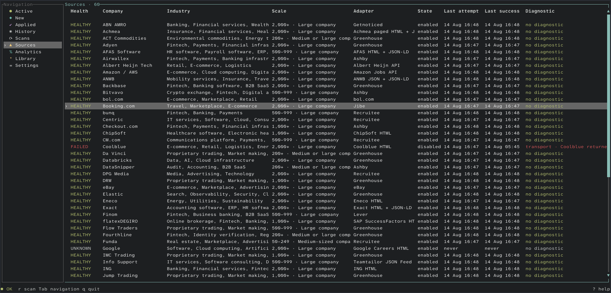
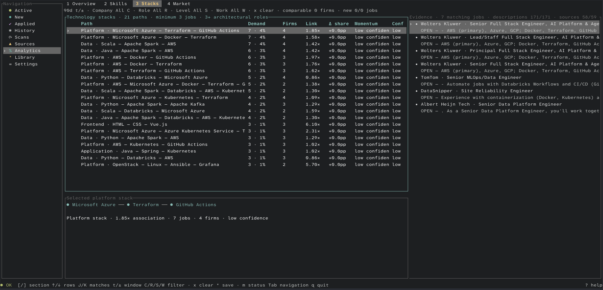

# User guide

TechJobsNL starts from stored local data and scans only when you request it. The main workflow is: scan sources, review eligible jobs, mark applications, then use analytics and the library to guide your search.

## Start the app

From the repository root:

```bash
cargo run --release
```

Or use the Make target:

```bash
make run
```

`make run` requires an interactive terminal. On first start, TechJobsNL creates `config.toml` and its SQLite database in the platform-specific user configuration directory.

## Navigation

The left navigation contains nine views:

1. **Active:** eligible vacancies still present in their official source.
2. **New:** active jobs published within the configured age window. Jobs without a publication date are not marked new.
3. **Applied:** jobs you marked as applied, including retained historical records.
4. **History:** closed jobs and jobs that closed and later reopened.
5. **Scans:** the latest 100 company scan outcomes and diagnostics.
6. **Sources:** health, adapter, enabled state, last attempt, last success, and latest diagnostic for every company.
7. **Analytics:** demand, trends, evidence, and personal recommendations.
8. **Library:** saved jobs, skills, stacks, roles, and companies.
9. **Settings:** simple editing for job age, countries, included title groups, and excluded title groups.

Press `Tab` or `Esc` to focus navigation, move with arrow keys or `j`/`k`, then press `Enter` to open the selected view. Inside a view, arrow keys or `j`/`k` move the current selection.

## Review jobs


The job list shows lifecycle state, publication date, company, and title. The detail pane shows official metadata, lifecycle dates, application state, and the posting description.

- `/`: enter search mode. Search matches job title or company, not description text.
- `↑`/`↓`: move through matching jobs without leaving search mode.
- `Enter`: keep the current search and return to normal controls.
- `Esc` while editing: cancel and clear the search. To clear an accepted search, press `/`, then `Esc`.
- `f`: cycle through configured companies, New, Applied, then All.
- `a`: mark or unmark the selected job as applied.
- `o`: open the selected job's official URL in the default browser.
- `c`: copy the selected job URL to the clipboard.
- `J`/`K`: scroll the detail pane.
- `*`: save or remove the selected job from the Library. Saved rows show `★` (`S` with ASCII icons), and the footer confirms the action.
- `h`: switch directly between Active and History.

On terminals narrower than 80 columns, `Enter` opens or closes the selected job's detail view. On wider terminals, `Enter` opens the official job URL.

## Scan sources

Press `r` to scan all enabled companies. Scans use the configured concurrency, timeout, retry count, and user agent.

Each company finishes independently:

- **Complete:** the result is trusted. Observed jobs are added or updated, and previously open source IDs absent from the complete result are closed.
- **Incomplete:** the diagnostic is stored, but no jobs from that company are added, updated, or closed.
- **Failed:** the failure is stored, but no jobs from that company are added, updated, or closed.

One failed or incomplete company does not discard successful results from other companies. The footer shows an animated scan loader, current progress, completion feedback, and durable Failed or Incomplete source counts.

## Inspect source health



The Sources view helps separate a current source failure from old stored jobs. Use it to check which company failed, the adapter in use, when it was last attempted, when it last succeeded, and the latest diagnostic.

## Use analytics

Analytics describes the postings TechJobsNL observed. It is not a complete measure of the Netherlands labour market.

Shared controls:

- `1`–`4` or `[`/`]`: switch Analytics sections.
- `t`: cycle 7, 30, and 90-day windows.
- `+`/`-`: add or remove one day from the window.
- `C`: cycle company filters.
- `R`: cycle role-family filters.
- `S`: cycle seniority filters.
- `W`: cycle work-mode filters.
- `x`: clear company, role, seniority, and work-mode filters while preserving the time window.
- Arrow keys or `j`/`k`: select rows.
- `J`/`K`: select matching evidence jobs.
- `Enter` or `o`: open the selected evidence job.
- `*`: save or remove the selected recommendation, skill, stack, role, or company.

### Overview


Overview combines hard-skill demand, role demand, career recommendations, and matching posting evidence. Recommendations use observed demand, target roles, known adjacent skills, momentum, and confidence.

### Skills

Skills uses **Hard Skills** and **Soft Skills** sub-tabs so the active table keeps the full available width on small terminals. Use Left/Right or click a sub-tab to switch. Each sub-tab preserves its own selected row. Press `m` to cycle a saved skill through Known, Learning, Interested, then no status.

Skill extraction uses the versioned local bank and exact posting aliases. Unknown words are not automatically promoted to skills.

### Stacks



Stacks shows common 2–5 skill paths, their job and company support, association, momentum, confidence, and matching evidence. `analytics.minimum_cooccurrence` controls the minimum shared-job count.

### Market

Use Left/Right to switch between Roles, Seniority, Experience, Work, and Companies. The Work section includes work mode, employment, and education measures.

Momentum and confidence depend on comparable complete scan periods. A low-confidence label means the available history is not strong enough for a reliable trend claim.

## Build a personal library

Select a job or an Analytics recommendation, skill, stack, role, or company and press `*`. Then open Library and choose its matching section.

Each action shows short footer feedback such as **Saved**, **Removed**, **Copied**, **Opened**, **Applied**, or an error. Work that can take time—scanning, job reloads, analytics, and optional AI discovery—shows an animated loader.

Library sections are selected with `1`–`5` or `[`/`]`:

1. **Jobs:** starred jobs, including closed or reopened saved jobs. Press `Enter` to locate an open job in Active or a closed job in History; use `o` to open its official URL and `c` to copy it.
2. **Skills:** saved skills and optional AI suggestions.
3. **Stacks:** saved technology paths.
4. **Roles:** saved role families; press `m` to mark or unmark a target role.
5. **Companies:** saved companies.

Press `*` to remove the selected library item. In Skills, press `m` to change status. Optional AI suggestions require explicit review: `a` approves and `d` rejects; suggestions never change analytics automatically.

## Change simple settings

Select a setting and press `Enter` or Space to edit it:

- **New jobs:** publication-age window in days.
- **Locations:** uppercase two-letter country codes.
- **Job types:** six built-in included-title groups plus optional custom regular expressions.
- **Hide jobs:** five built-in excluded-title groups plus optional custom regular expressions.

Country and title changes apply on the next scan. Clearing all included title patterns permits every job type; clearing all excluded title patterns excludes none. Use the full configuration file for scan, analytics, theme, keybinding, company, and source settings.

## Mouse and responsive layout

- Click navigation items, rows, Analytics tabs, Library tabs, Settings fields, or Help.
- Use the wheel over a list to change selection and over details to scroll.
- Drag the divider between the job list and details to resize the panes for the current session.
- On narrow terminals, job and operational details open as a separate surface so required fields remain readable.

## Built-in help

Press `?` to open the context-aware cheat sheet. It presents aligned key/action pairs for navigation and the current view, plus an explicit **Save to Library** workflow. In Analytics it also explains the Hard/Soft Skills sub-tabs. Press `?` or `Esc` to close it.
